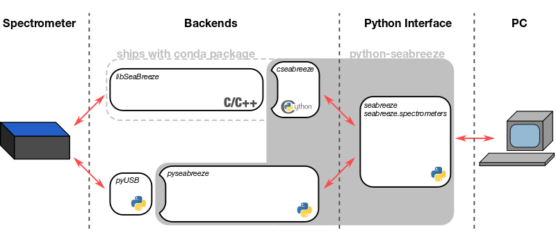

# Python module for [Ocean Optics](http://www.oceanoptics.com/) spectrometers

[](https://anaconda.org/poehlmann/python-seabreeze)
[](https://anaconda.org/poehlmann/python-seabreeze/files)
[](https://ci.appveyor.com/project/ap--/python-seabreeze)
[](https://travis-ci.org/ap--/python-seabreeze)
[](https://github.com/ap--/python-seabreeze/releases)
[](http://opensource.org/licenses/MIT)
[](https://github.com/ap--/python-seabreeze/issues)
[](https://paypal.me/apoehlmann)

Python-seabreeze is the easy way to access your Ocean Optics spectrometers from
python. It wraps the [SeaBreeze](http://oceanoptics.com/product/seabreeze/)
library provided by Ocean Optics to communicate with the spectrometer. If
SeaBreeze is not available it can fallback to a pyUSB based reimplementation.
**This software is not associated with Ocean Optics. Use it at your own risk.**


## tl;dr -- give me the spectrum now!

```
conda install -c poehlmann python-seabreeze
```

**if windows (** force your spectrometer to use a driver from [here](misc/windows-driver-files.zip) **)** <br>
**if linux (** install udev rules from [here](misc/10-oceanoptics.rules) **)**

```python
>>> import seabreeze.spectrometers as sb
>>> spec = sb.Spectrometer.from_serial_number()
>>> spec.integration_time_micros(20000)
>>> spec.wavelengths()
array([  340.32581   ,   340.70321186,   341.08058305, ...,  1024.84940994,
        1025.1300678 ,  1025.4106617 ])
>>> spec.intensities()
array([  1.58187931e+01,   2.66704852e+04,   6.80208103e+02, ...,
         6.53090172e+02,   6.35011552e+02,   6.71168793e+02])
```

_Consider supporting open source software and_ [_buying me a beer_](https://paypal.me/apoehlmann).


## Overview



Starting with version _0.6.0_, python-seabreeze is available as a pre-built
package for Python versions _2.7.x_, _3.5.x_, _3.6.x_ on _win-32_, _win-64_,
_osx-64_, _linux-64_ and _linux-armv7l_ via anaconda. The module supports communicating with
[various Ocean Optics spectrometers](#supported-devices) via one of two
backends. More information on the backends is available
[here](docs/BACKENDS.md). The recommended default is **cseabreeze**.
Everything required ships with the conda package.


## Installation


### THE RECOMMENDED WAY - Anaconda

python-seabreeze now ships pre-built packages for
[Anaconda](https://www.continuum.io/downloads). If you're not using Anaconda
yet, start using it now. As a scientist, who spent way to much time dealing
with stupid computer problems, I urge you to switch all your python development
to Anaconda environments. It'll save you a lot of time, believe me.
(for RaspberryPIs I recommend using [Berryconda](https://github.com/jjhelmus/berryconda))

To install the module run the following in your conda environment. This will
install the module and the dependencies you need for the cseabreeze backend.

```bash
conda install -c poehlmann python-seabreeze
```

**IF WINDOWS:**
you need to install driver-files for your spectrometer from [here](misc/windows-driver-files.zip). These drivers tell windows to use the winusb driver for the spectrometer. It's
possible that OceanView won't find the spectrometer anymore after this. Extract the drivers to a location you like. Goto _Device Manager_. Select your spectrometer, _right click_ and _update driver software_.
Then choose a suiting driver from the extracted folder.

**IF LINUX:**
you need to install the udev rules from [here](misc/10-oceanoptics.rules). These give all users access to connected usb spectrometers and are required, so that you can access the
spectrometers via libusb as a user without root privileges. Download and copy this file to `/etc/udev/rules.d/` and run `sudo udevadm control --reload-rules`. Replug your spectrometer.

**IF OSX:**
You're all set. It should already work.


### THE 400 OTHER WAYS - ...

| Platform | OS      | interpreter | backend     | instructions |
| -------- | ------- | ----------- | ----------  | ------------ |
| x86/x64  | Windows | Anaconda    | pyseabreeze | [recommended](README.md#the-recommended-way---anaconda) + [pyusb](docs/BACKENDS.md#install-pyseabreeze)
| x86/x64  | Windows | Python.org  | cseabreeze  | [windows](docs/WINDOWS_INSTALL.md)
| x86/x64  | Windows | Python.org  | pyseabreeze | [without-cseabreeze](docs/BACKENDS.md#install-python-seabreeze-without-cseabreeze) + [pyusb](docs/BACKENDS.md#install-pyseabreeze)
| x86/x64  | OSX     | Anaconda    | pyseabreeze | [recommended](README.md#the-recommended-way---anaconda) + [pyusb](docs/BACKENDS.md#install-pyseabreeze)
| x86/x64  | OSX     | Python.org  | cseabreeze  | [osx](docs/MACOSX_INSTALL.md)
| x86/x64  | OSX     | Python.org  | pyseabreeze | [without-cseabreeze](docs/BACKENDS.md#install-python-seabreeze-without-cseabreeze) + [pyusb](docs/BACKENDS.md#install-pyseabreeze)
| x86/x64  | Linux   | Anaconda    | pyseabreeze | [recommended](README.md#the-recommended-way---anaconda) + [pyusb](docs/BACKENDS.md#install-pyseabreeze)
| x86/x64  | Linux   | Python.org  | cseabreeze  | [linux](docs/LINUX_INSTALL.md)
| x86/x64  | Linux   | Python.org  | pyseabreeze | [without-cseabreeze](docs/BACKENDS.md#install-python-seabreeze-without-cseabreeze) + [pyusb](docs/BACKENDS.md#install-pyseabreeze)
| ARM      | Linux   | Python.org  | cseabreeze  | [linux](docs/LINUX_INSTALL.md)
| ARM      | Linux   | Python.org  | pyseabreeze | [without-cseabreeze](docs/BACKENDS.md#install-python-seabreeze-without-cseabreeze) + [pyusb](docs/BACKENDS.md#install-pyseabreeze)

If you think that you can't install this module because there is something
wrong with it, read through the installation instructions again. Then try to
look for a solution for your problem [on the internet](https://www.google.com)
at least three times. If nothing helped, read the [contributing
guidelines](#contributing-guidelines), file an issue on github and be nice.
Please note, that I am not an Ocean Optics employee and am maintaining this
module in my free time.


## Usage

The following example shows how simple it is to acquire a spectrum with
python-seabreeze through the model independent _Spectrometer_ class. For a more
detailed description read the (currently incomplete) [documentation](docs/DOCUMENTATION.md).:

```python
>>> import seabreeze.spectrometers as sb
>>> devices = sb.list_devices()
>>> print(devices)
[<SeaBreezeDevice USB2000PLUS:USB2+H02749>, <SeaBreezeDevice USB2000PLUS:USB2+H02751>]
>>> spec = sb.Spectrometer(devices[0])
>>> spec.integration_time_micros(12000)
>>> spec.wavelengths()
array([  340.32581   ,   340.70321186,   341.08058305, ...,  1024.84940994,
        1025.1300678 ,  1025.4106617 ])
>>> spec.intensities()
array([  1.58187931e+01,   2.66704852e+04,   6.80208103e+02, ...,
         6.53090172e+02,   6.35011552e+02,   6.71168793e+02])
```

To use the pyseabreeze backend simply run this before importing
seabreeze.spectrometers. The pyseabreeze backend requires [pyUSB](https://walac.github.io/pyusb/) to be
installed. (Look at the [backends documentation](docs/BACKENDS.md) for more
info.)

```python
>>> import seabreeze
>>> seabreeze.use('pyseabreeze')
>>> import seabreeze.spectrometers as sb
```

## Supported Devices

| Spectrometer | cseabreeze | pyseabreeze |
|:-------------|:----------:|:-----------:|
| HR2000       |     x      |      x      |
| HR2000PLUS   |     x      |      x      |
| HR4000       |     x      |      x      |
| JAZ          |     x      |      x      |
| MAYA2000     |     x      |      x      |
| MAYA2000PRO  |     x      |      x      |
| MAYALSL      |     x      |      x      |
| NIRQUEST256  |     x      |      x      |
| NIRQUEST512  |     x      |      x      |
| QE65000      |     x      |      x      |
| QE-PRO       |     x      |      x      |
| STS          |     x      |      x      |
| TORUS        |     x      |      x      |
| USB2000      |     x      |      x      |
| USB2000PLUS  |     x      |      x      |
| USB4000      |     x      |      x      |
| USB650       |            | [Issue #47](https://github.com/ap--/python-seabreeze/issues/47) |
| SPARK        |     x      |             |


## Known Issues

- USB2000 spectrometers cause `Data transfer error` due to old firmware [Issue #48](https://github.com/ap--/python-seabreeze/issues/48)
- USB650 not supported [Issue #47](https://github.com/ap--/python-seabreeze/issues/47)
- No conda packages for armv6 (RPI version 1) [Issue #46](https://github.com/ap--/python-seabreeze/issues/46)

## Contributing Guidelines

If you run into any problems, file an issue and be sure to include the
following in your report:

- Operating system (Linux distribution, Windows version, OSX version) and
  archictecture (32bit, 64bit, arm)
- Python version and arch (i.e. Python 2.7.10 64bit)
- python-seabreeze version

If you want a feature implemented, please file an issue, or create a pull
request when you implement it yourself. And if you would like to support me via
paypal, click on the paypal donate button on top of this README.

 
## License

Files in this repository are released under the [MIT license](LICENSE.md).


## Related Repositories

If you want me to add your project here, let me know. Happy to add it.

- [SeaBreeze](https://sourceforge.net/projects/seabreeze/) - Ocean Optics' SeaBreeze C library.
- [libseabreeze](https://github.com/ap--/libseabreeze) - github clone of the C library. _internal use only_ (has pre-built libraries if you know what you're doing)
- [python-seabreeze-feedstock](https://github.com/ap--/python-seabreeze) - anaconda feedstock for automated package deployment. _internal use only_


