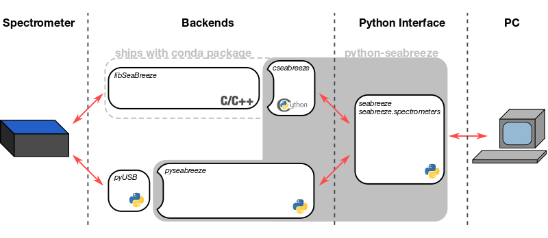

# Backends



### cseabreeze (recommended) ###

Since version _0.6.0_ the cseabreeze backend is packaged together with the
conda package, so it's installed by default. The backend is a very thin wrapper
around the [SeaBreeze](http://oceanoptics.com/product/seabreeze/) library. It's
written in [Cython](http://cython.org) and uses the _SeaBreeze 2.0 API_
("SeaBreezeAPI.h" instead of "SeaBreezeWrapper.h"). 

Since the open source SeaBreeze library is developed by Ocean Optics it should
work nicely with all listed Spectrometers. All the heavy lifting, like
formatting commands for communication with the spectrometer is done in the
C/C++ library.

Currently not all funtionality of SeaBreeze is exposed via cseabreeze. If you
require some functionality that's available in SeaBreeze but not yet in
python-seabreeze, file an issue, or implement it yourself and create
a pull-request.

##### install python-seabreeze without cseabreeze

Note that if you want, you can install python-seabreeze without the cseabreeze backend by running:

```bash
# Run this in the downloaded repository folder
python setup.py install --without-cseabreeze
```


### pyseabreeze ###

The pyseabreeze backend is an implementation of cseabreeze using
[pyusb](https://github.com/walac/pyusb). It originated from
[python-oceanoptics](https://github.com/ap--/python-oceanoptics).
pyseabreeze does all the heavy lifting in Python. It supports all basic spectrometer features (check [this list](seabreeze/pyseabreeze/TODO.md) for what works and what doesn't.)

##### install pyseabreeze

If you want to use pyseabreeze as the backend, install pyUSB:

```bash
# make sure pip --version is >= 8.0.0
pip install pyusb
```

**IF WINDOWS (** Force the spectrometer to use a libusb driver via [Zadig](http://zadig.akeo.ie/) **)**

**IF OSX (** I recommend installing libusb via [homebrew](https://brew.sh/): `brew install libusb` **)**

**IF LINUX (** It's very likely you already have libusb installed **)**

PyUSB is only correctly installed, if the following code runs and does not raise an Exception.

```python
import usb.core
usb.core.find()
```

Now you can switch to using the pyseabreeze backend by running:

```python
import seabreeze
seabreeze.use("pyseabreeze")
import seabreeze.spectrometers as sb
```
