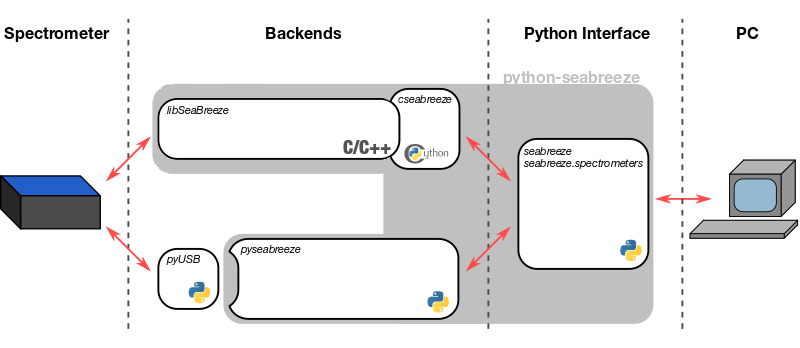

================
python-seabreeze
================

python-seabreeze is the easy way to access your Ocean Optics spectrometers from
python. It wraps the `SeaBreeze`_ library provided by Ocean Optics to communicate
with the spectrometer. If SeaBreeze is not available it can fallback to a `pyUSB`_
based reimplementation.

.. _SeaBreeze: http://oceanoptics.com/product/seabreeze/
.. _pyUSB: http://pyusb.github.io/pyusb/

.. Attention::
    This software is not associated with Ocean Optics.
    Use it at your own risk.

It's recommended to read the :ref:`Installing python-seabreeze section <install-seabreeze>`,
the :ref:`Quickstart Guide <quickstart>` and the :ref:`API documentation <api>`. Also check
out the :ref:`Contributing Guide <contrib>` if you want to learn how to contribute to the project.
A changelog is available `here <https://github.com/ap--/python-seabreeze/blob/master/CHANGELOG.md>`_.

    python-seabreeze module structure

python-seabreeze in the wild
============================

python-seabreeze is used in many labs around the world. One of the cool examples was
a `student project measuring fluorescence spectra (#17)
<https://www.spacestationexplorers.org/new-student-experiments-reach-iss-on-spacex-crs-14>`_ with a
``Spark`` spectrometer controlled by a raspberry pi zero, which was sent to the International
Space Station on the SpaceX CRS-14 resupply mission. *(space proof software*\ :sup:`TM`\ *)*

.. tip::

    If you use python-seabreeze in your project let me know about it and I'll add it here :)

.. rubric:: projects

- `python-seatease by @jonathanvanschenck`_ - a software emulator of python-seabreeze. Emulates seabreeze's behavior so for testing my code without access to a spectrometer.
- `python-seabreeze-server by @jonathanvanschenck`_ - a TCP-based server to host the seabreeze.cseabreeze backend, allowing multiple clients (potentially offsite) to interact with a single spectrometer.
- SeaBreeze_ - Ocean Optics' SeaBreeze C library.
- libseabreeze_ - github clone of the C library. *internal use only* (has pre-built libraries if you know what you're doing)
- python-seabreeze-feedstock_ - anaconda feedstock for automated package deployment. *internal use only*
- yaqd-seabreeze_ - A seabreeze interface for the `yaq instrument control framework`_

.. _`python-seatease by @jonathanvanschenck`: https://github.com/jonathanvanschenck/python-seatease
.. _`python-seabreeze-server by @jonathanvanschenck`: https://github.com/jonathanvanschenck/python-seabreeze-server
.. _libseabreeze: https://github.com/ap--/libseabreeze
.. _python-seabreeze-feedstock: https://github.com/ap--/python-seabreeze
.. _yaqd-seabreeze: https://gitlab.com/yaq/yaqd-seabreeze
.. _`yaq instrument control framework`: https://yaq.fyi

---------------------------------------------------------------------------------------------------

.. sidebar:: A note from the author
    :subtitle: (ノ\*-_-\*)ノ┴—┴

    Over the years, maintaining this project made me aware that supporting the authors of
    open source projects is a crucial (but mostly ignored) part of the open source community.
    If python-seabreeze_ saved you some development time, consider `contributing to the
    project <https://github.com/ap--/python-seabreeze>`_, or
    `send me an email <mailto:mail+seabreeze@poehlmann.io>`_ and tell me about your project,
    or consider `buying me a coffee <https://www.buymeacoffee.com/poehlmann>`_,
    or support me via `patreon <https://patreon.com/apoehlmann>`_ or
    `paypal <https://paypal.me/apoehlmann>`_. Something small like that
    puts a smile on my face for weeks, and it's extremely motivating.

    .. rubric:: Anyways, enough ranting (^_^") think about it and let's science!

    .. image:: https://bmc-cdn.nyc3.digitaloceanspaces.com/BMC-button-images/custom_images/orange_img.png
        :target: https://www.buymeacoffee.com/poehlmann
        :alt: Buy Me A Coffee
        :align: center

.. _python-seabreeze: https://github.com/ap--/python-seabreeze

========
Contents
========

.. toctree::
   :caption: Introduction:
   :maxdepth: 3

   tldr.rst
   install.rst
   quickstart.rst
   troubleshoot.rst

.. toctree::
   :caption: Development:

   api.rst
   backend_api.rst

.. toctree::
   :caption: Support:

   contributing.rst

Indices and tables
==================
* :ref:`genindex`
* :ref:`modindex`
* :ref:`search`
